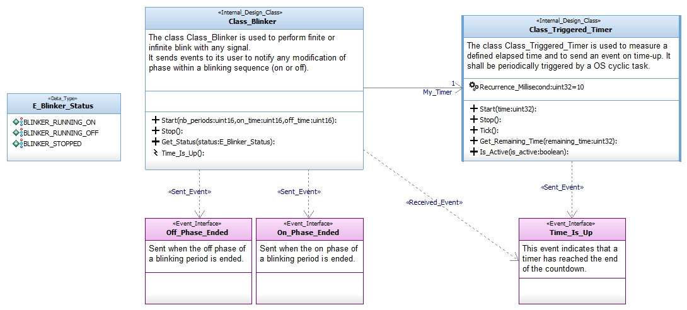
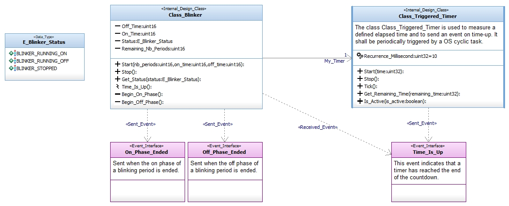

# Class_Blinker

Allows to perform finite or infinite blink with any signal.
It sends events to its user to notify any modification of phase within a 
blinking sequence (on or off).

Modeled using the [Software_Model_Toolset](https://github.com/HomeMadeRobots/Software_Model_Toolset).

Implemented using the [Embedded_C_Framework](https://github.com/HomeMadeRobots/Embedded_C_Framework).

## Needed repositories

This repo use the following repositories :
- [Class_Triggered_Timer](https://github.com/HomeMadeRobots/Class_Triggered_Timer)

## Use

The *Start( IN nb_periods:uint16, IN on_time:uint16, IN off_time:uint16 )* 
method allows to start the blinker. The on phase will last *on_time* ms, the off
phase will last *off_time* ms. The blink pattern will be repeated *nb_periods*
times. If *nb_periods* is set to 0, the blink pattern is infinite, it will 
continue until the call of the *Stop()* method.

The method *My_Timer__Time_Is_Up()* is an event reception that shall be called
when the event *Time_Is_Up* of the associated Class_Triggered_Timer
(*My_Timer*) is sent.

### Example

## Internal design

### Start method

### Stop method

### Get_Status method

### My_Timer__Time_Is_Up method

### Begin_On_Phase method

### Begin_Off_Phase method

